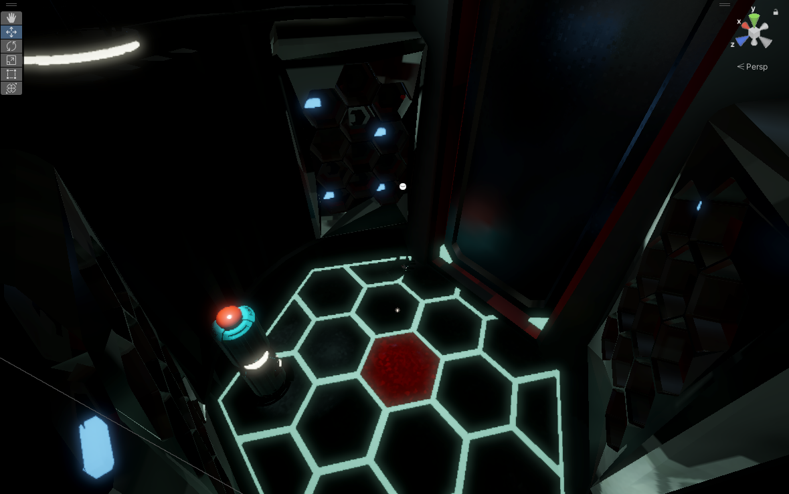
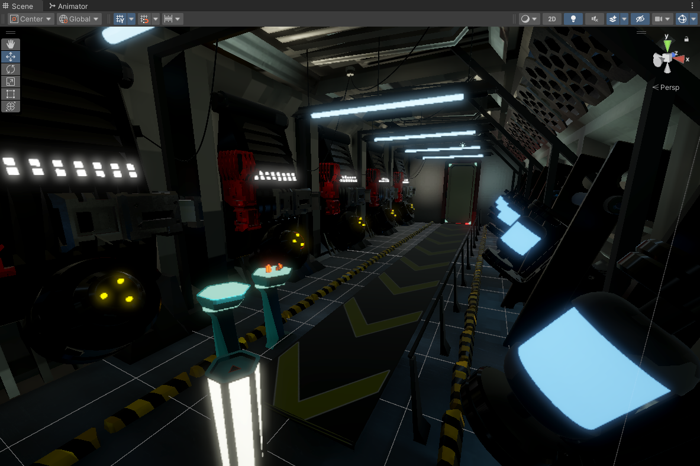
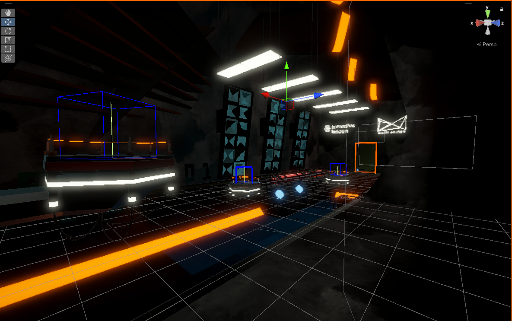
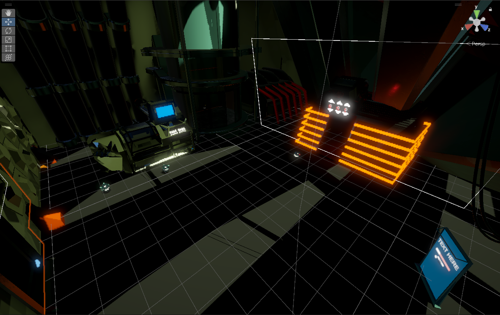
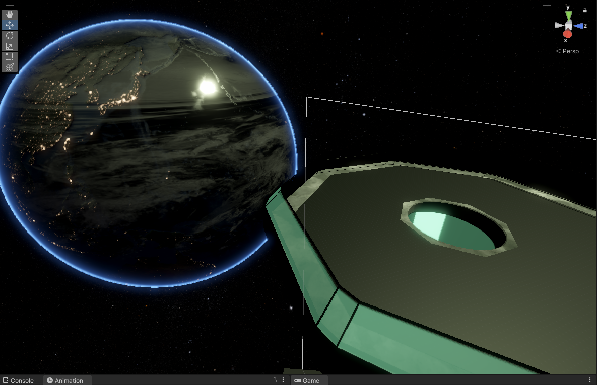

# IIVRScapeRoom
Scape Room in Virtual Reality made with Unity

🚀 First Steps in VR — and They Felt Huge
For 4 weeks, guided by Immersive Insiders and using their learning resources, I built my very first VR experience in Unity.
This was my first real dive into the engine — starting from a completely empty scene and watching it slowly transform into something interactive and alive.
Every little feature I made work felt like pure magic.

🛠 What I Learned & Built
🚪 Animated elements — doors that open and a moving conveyor belt

🔘 Interactive controls — functional push buttons with programmed actions

🚶‍♂️ Player movement — smooth walking and teleportation locomotion

🔍 Gameplay interactions — object and shape recognition

🎭 Layer Mask mechanics — controlling what the player can see and interact with

🎵 Audio design — adding and controlling sounds for immersion

✨ Why It Matters
This project wasn’t just about learning Unity — it was about unlocking a new creative toolkit.
Even these first steps made me feel like I was opening the door to an entirely new world.
Now, the real adventure begins.

ROOMS:

